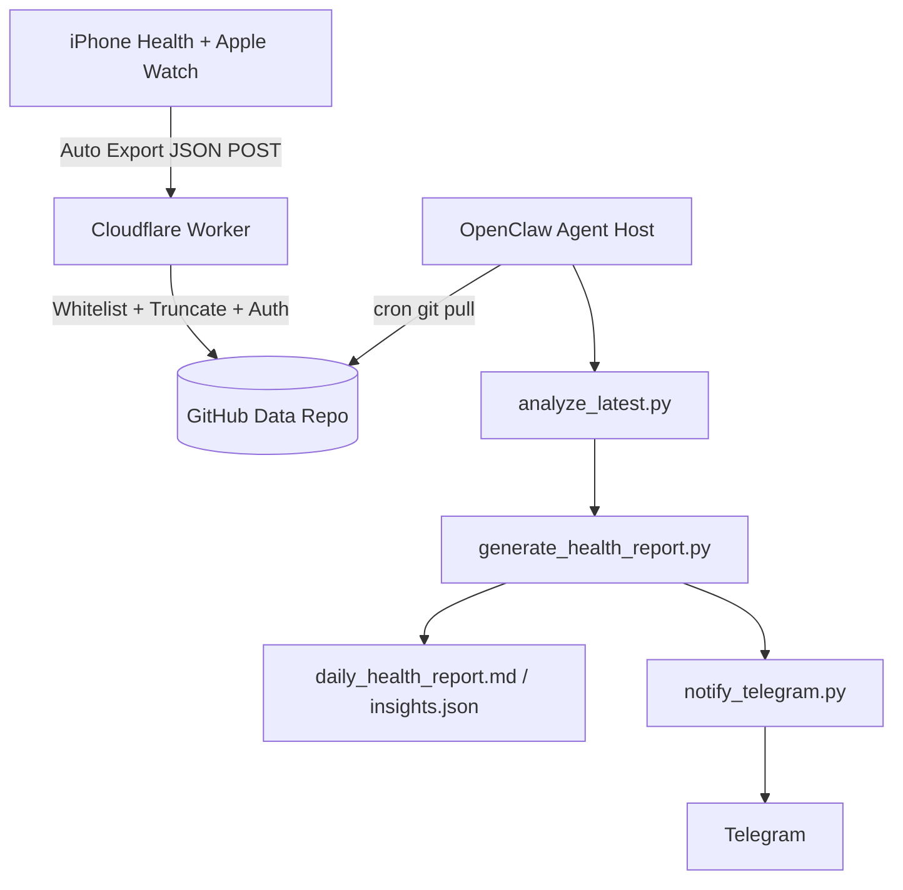
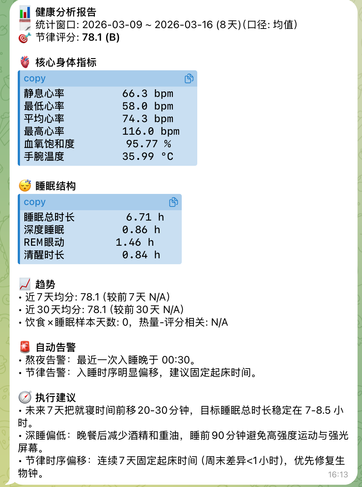

# Apple Watch + OpenClaw Health Pipeline

从零搭建一条可运行的健康数据闭环：

- iOS `Health Auto Export` 自动导出 JSON
- Cloudflare Worker 鉴权 + 过滤 + 截断 + 入库 GitHub
- OpenClaw Agent 定时 `git pull` 分析打分
- 自动生成结构化健康报告（告警/趋势/饮食交叉）
- 自动推送 Telegram

> 目标：**可读、可执行、可复盘、可扩展**。

---

## 1. 架构总览



---

## 2. 仓库角色（强烈建议分层）

- **代码仓（公开）**：本仓库（pipeline 代码 + 文档）
- **数据仓（私有）**：仅存健康数据与报告产物（`latest.json` / `archive` / `report`）

这样可避免隐私数据或敏感配置泄露。

---

## 3. 目录结构

```text
cloudflare_worker/
  index.js               # Worker: ingest/filter/truncate/write GitHub
  wrangler.toml          # Worker 配置模板（无密钥）

openclaw_agent/
  pull_and_score.sh      # 一键 pull + 分析 + 报告 + Telegram
  analyze_latest.py      # 节律评分输入构建与计算
  generate_health_report.py # 结构化健康报告 + 告警 + 周月趋势 + 饮食交叉
  notify_telegram.py     # Telegram 推送
  diet_log_template.csv  # 精确营养录入模板
  meal_text_log_template.csv # 自然语言餐食录入模板
```

---

## 4. 先决条件

- iPhone 安装 `Health Auto Export`
- Cloudflare 账号（Workers）
- GitHub 账号（可创建私有数据仓）
- OpenClaw Agent 主机（Linux/macOS 均可）
- 主机工具：`python3` `git` `cron` `node/npm`

---

## 5. 密钥管理（统一走 env / secret）

**绝不入仓库**：

- `INGEST_KEY`
- `GITHUB_TOKEN`
- `CLOUDFLARE_API_TOKEN`
- `TELEGRAM_BOT_TOKEN`

推荐：

- Worker 内密钥 -> `wrangler secret put`
- 系统脚本密钥 -> `/root/.health_pipeline.env`（`chmod 600`）

---

## 6. 从零部署步骤

### Step A. 创建私有数据仓

例如：`<your-user>/data_sync_analysis`（private）

### Step B. 配置并部署 Worker

1) 编辑 `cloudflare_worker/wrangler.toml`：

- `GITHUB_OWNER`
- `GITHUB_REPO`
- `GITHUB_BRANCH`

2) 设置 Worker secrets：

```bash
cd cloudflare_worker
wrangler secret put INGEST_KEY
wrangler secret put GITHUB_TOKEN
```

3) 部署：

```bash
wrangler deploy
```

### Step C. iOS Auto Export 配置

- Export Format: `JSON`
- Export Method: `REST API (POST)`
- URL: `https://<your-worker-or-custom-domain>`
- Header:
  - Key: `X-Auth-Key`
  - Value: 与 `INGEST_KEY` 一致
- 建议：开启 `Since Last Sync`

### Step D. Agent 主机部署

将本仓 `openclaw_agent/` 放到主机，例如：

- `/root/applewatch-openclaw-health-adviser/openclaw_agent`

准备环境变量文件 `/root/.health_pipeline.env`：

```bash
HEALTH_REPO_URL=https://github.com/<you>/<data-repo>.git
HEALTH_REPO_BRANCH=main
HEALTH_REPO_DIR=/root/.openclaw/workspace/health-data
HEALTH_GITHUB_PAT=<github_pat_for_private_repo>

# Telegram (optional but recommended)
TELEGRAM_BOT_TOKEN=<bot_token>
TELEGRAM_CHAT_ID=<chat_id>
```

权限：

```bash
chmod 600 /root/.health_pipeline.env
```

### Step E. 首次手动验证

```bash
set -a; source /root/.health_pipeline.env; set +a
/root/applewatch-openclaw-health-adviser/openclaw_agent/pull_and_score.sh
```

成功标志：

- `data/report/latest_score.json`
- `data/report/insights.json`
- `data/report/daily_health_report.md`
- 终端出现 `telegram_sent_ok`

### Step F. 定时任务（系统 cron）

示例：每天 08:18

```cron
18 8 * * * . /root/.health_pipeline.env; /root/applewatch-openclaw-health-adviser/openclaw_agent/pull_and_score.sh >> /tmp/health_pipeline.log 2>&1 # health-pipeline
```

---

## 7. 报告内容设计（已实现）

### 7.1 核心指标（多天自动取平均）

- 静息心率
- 最高/最低/平均心率
- 血氧饱和度
- 手腕温度
- 睡眠总时长
- 深度睡眠
- REM（眼动）
- 清醒时长

> 缺失数据自动输出 `N/A`，不会中断报告。

### 7.2 自动告警

- 熬夜告警（最近入睡晚于 00:30）
- 节律偏移告警（Timing 低）
- 睡眠债告警（均值偏低）

### 7.3 饮食分析（有数据才显示）

支持两种输入：

1) 精确营养（推荐）
- `data/diet/diet_log.csv`

2) 自然语言（你只写吃了什么）
- `data/diet/meal_text_log.csv`
- 会自动估算热量/蛋白/碳水/脂肪，输出 `meal_text_estimated.csv`

#### OpenClaw 自然语言录入示例

在 OpenClaw 对话里可以用自然语言记录餐饮（由 Agent 落盘到 `meal_text_log.csv`）：

```text
今天中午吃了芹菜金针菇蛋汤、青椒牛柳、红烧鲫鱼、炒生菜、一小碗米饭
```

对应落盘格式：

```csv
timestamp,meal,description
2026-03-17 12:30:00,lunch,芹菜金针菇蛋汤、青椒牛柳、红烧鲫鱼、炒生菜、一小碗米饭
```

然后在下一次 `pull_and_score.sh` 执行时自动完成：

1. 菜品识别与营养估算（热量/蛋白/碳水/脂肪）
2. 当日营养合理度评价（够不够、过不过）
3. 纳入“饮食 × 睡眠”交叉分析与趋势报告

并自动做：

- 当日营养搭配合理度评估
- 近30天“热量 vs 睡眠评分”相关性

### 7.4 周度/月度趋势

- 近7天均分与前7天对比
- 近30天均分与前30天对比

---

## 8. 运行与验收清单

1) Worker `tail` 能看到 `ingest_received` + `ingest_written`
2) 数据仓出现：
- `data/latest.json`
- `data/archive/YYYY/MM/DD/*.json`
3) Agent 侧生成：
- `latest_score.json`
- `insights.json`
- `daily_health_report.md`
4) Telegram 收到分列式报告（含 emoji）

### Telegram 最终报告效果

> Telegram收到最终报告效果



---

## 9. 常见问题与修复

### Q1. iOS 导出成功，但 GitHub 没更新

看 Worker tail：

- 若出现 `reject_too_large`：调大 `MAX_REQ_BYTES`
- 若出现 `reject_auth`：`X-Auth-Key` 不匹配
- 若 `ingest_written` 有但仓库不变：检查 `GITHUB_OWNER/GITHUB_REPO/BRANCH`

### Q2. Telegram 推送失败

- 检查 `TELEGRAM_BOT_TOKEN` / `TELEGRAM_CHAT_ID`
- Bot 是否已在目标聊天中收到过消息
- 若使用 HTML parse mode，动态文本需转义（本仓已处理）

### Q3. 报告指标缺失

- 源数据本期不存在该指标时会显示 `N/A`
- 不会中断主流程

---

## 10. 安全建议

- 所有 token 最小权限、短 TTL、定期轮换
- 数据仓保持 private
- 不在日志中打印明文密钥
- 公开仓只保留模板和说明，不含敏感配置

---

## 11. 一句话执行命令（主机）

```bash
set -a; source /root/.health_pipeline.env; set +a; /root/applewatch-openclaw-health-adviser/openclaw_agent/pull_and_score.sh
```

查看最新一次评分时间戳与分数（避免手写内联 Python）：

```bash
python3 /root/applewatch-openclaw-health-adviser/openclaw_agent/print_latest_score.py --repo-dir /root/.openclaw/workspace/health-data
```

---

## 12. 许可证

建议 MIT（可自行添加 `LICENSE` 文件）
